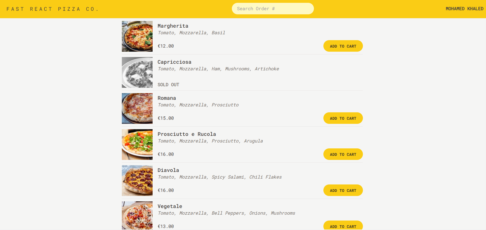

# Fast Pizza

Fast Pizza is a Redux project where people can order pizza without authentication, and track their orders from restaurant to destination.

## Project Features

- Online ordering web application, allowing users to order one or more pizzas from a menu.
- No need for user accounts or logins: users just input their names before placing an order.
- The pizza menu is loaded dynamically from an API, as it can change over time.
- Users can add multiple pizzas to a cart before ordering.
- Ordering requires the users to provide their name, phone number, and address.
- GPS location can also be provided, to make delivery easier.
- Users can mark their order as “priority” for an additional 20% of the cart price.
- Orders are submitted by sending a POST request with the user’s information and selected pizzas to the API.
- Payments are made on delivery, so no payment processing is necessary in the app.
- Each order will be assigned a unique ID, which should be shown to the user so they can track their order.

## Technologies

- Routing: [React Router](https://reactrouter.com/en/main)
- Styling: [TailwindCSS](https://tailwindcss.com/)
- Persist Remote State Management: [React Router](https://reactrouter.com/en/main/start/overview)
- UI State Management: [Redux Toolkit](https://redux-toolkit.js.org/)

[Back To The Top](#fast-pizza)

## Getting Started

To start the project, it is necessary to download the files from the github repository and after that run this commands:
 `'npm i'`   `'npm run dev'`

[Back To The Top](#fast-pizza)
