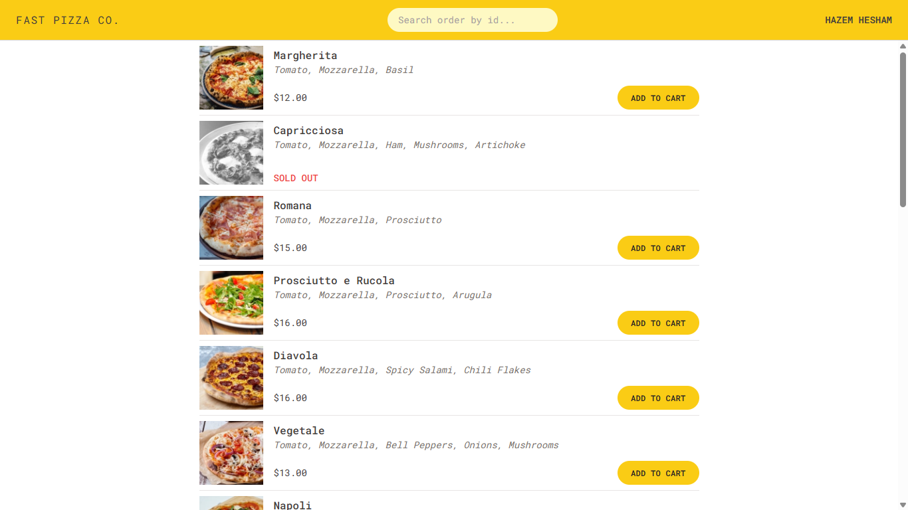
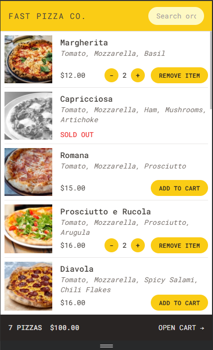
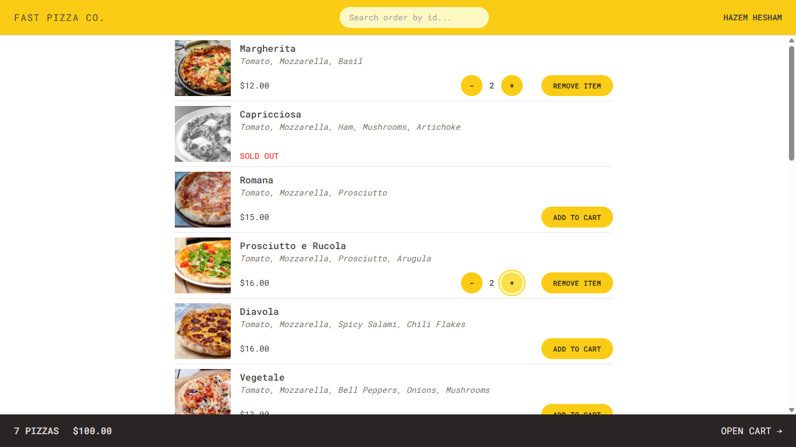
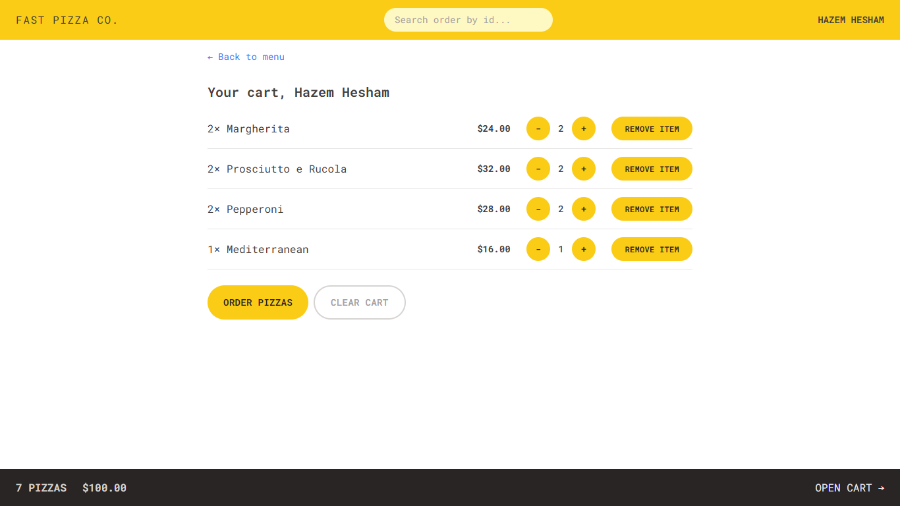
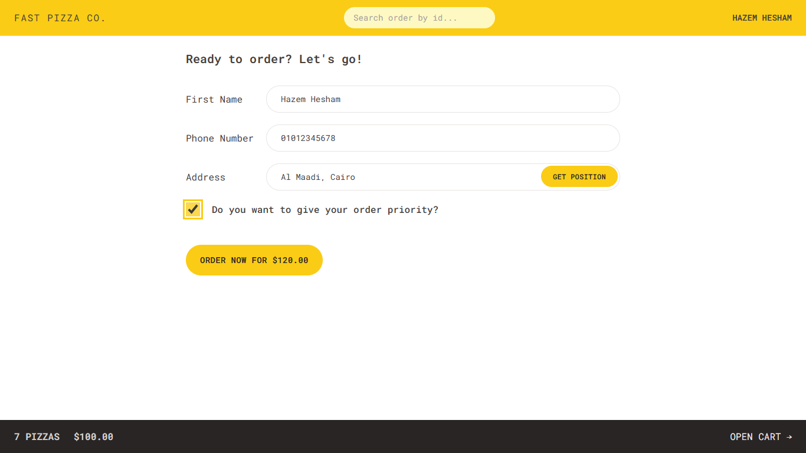
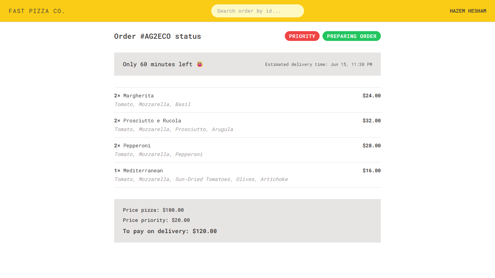
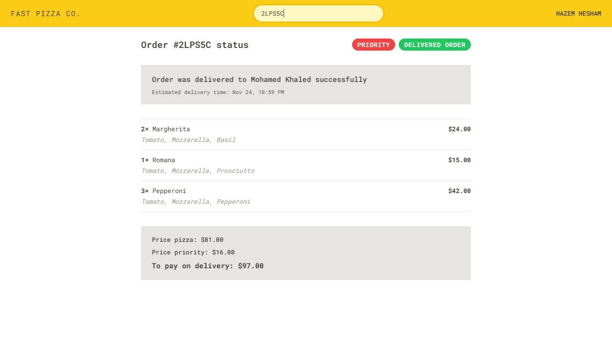

<div align="center">
    <h1>🍕 Fast Pizza</h1>
</div>

<div align="center">

    [Live Website](https://fast-pizza.netlify.app)

</div>

<div align="center">

    

</div>







## 📋 Overview

**Fast Pizza** is a Web Application built with Redux that allows users to order pizza quickly and easily — no authentication required. Just pick your pizzas, fill in your details, and track your order from the restaurant to your doorstep.


## 🔑 Project Features

- **Mobile Responsive Design**
Optimized layout and interactions for all screen sizes (phones, tablets, and desktops).

- **Dynamic Pizza Menu**
The menu is loaded from an API, so it's always up to date.

- **No Account Required**
Users can place an order by simply entering their name, phone number, and address.

- **Shopping Cart**
Add one or more pizzas to the cart before checking out.

- **Priority Delivery Option**
Users can mark their order as "priority" for faster delivery (20% extra charge).

- **GPS Support**
Optionally include a GPS location to help the restaurant with delivery.

- **Track Your Order**
After placing an order, users receive a unique order ID they can use to track their order status.

- **Payment on Delivery**
No online payment is handled in-app — users pay when the order is delivered.


## 🧭 How the App Works

### 1. Browse the Menu

The user sees a menu of pizzas to choose from.



---

### 2. Add to Cart

The user adds pizzas to his cart and proceeds to checkout.



---

### 3. Checkout

At checkout, the user enters his name, phone number, and address. GPS location is optional.



---

### 4. Order Confirmation

The app submits the order to the API. A unique order ID is returned and displayed to the user.



---

### 5. Track the Order

Users can use their order ID to track its status from the restaurant to their home.



---


## 🛠️ Tech Stack

- [React](https://reactjs.org/) : Frontend library for building user interfaces.

- [Redux Toolkit](https://redux-toolkit.js.org/) : A powerful state management library to keep states in a single centralized store.

- [Tailwind CSS](https://tailwindcss.com) : Utility-first CSS framework to build custom designs without writing custom CSS.

- [React Router](https://reactrouter.com/) : Client-side routing for SPA navigation.

- [Vite](https://vitejs.dev/) : Frontend build tool that improves the development.

- **Netlify**: For Hosting and continuous deployment.


## 📦 Getting Started

1. Clone the repository:
   ```bash
   git clone https://github.com/hazemhesham-1/fast-pizza.git
   ```
2. Navigate to the project directory:
   ```bash
   cd fast-pizza
   ```
3. Install the dependencies:
   ```bash
   npm install
   ```
4. Run the development server:
   ```bash
   npm run dev
   ```
5. Open your browser and navigate to [http://localhost:5173/](http://localhost:5173/).


---

🍕 **Happy Eating!**
Thank you for checking out **Fast Pizza**. Hope you enjoy exploring the project!

📬 **Feel free to contact me** if you have any questions.

**GitHub:** [hazemhesham-1](https://github.com/hazemhesham-1)